# Tarea 1 Creación y uso de elementos básicos en php


1. **Mayor de dos números**  
   Pide dos números y muestra cuál es mayor o si son iguales. 
    
```php
<?php
$numero1 = 10;
$numero2 =  5;
if ($numero1 == $numero2) {
    echo "Son iguales";
}
elseif ($numero1 > $numero2) {
    echo "numero: $numero1 es major que $numero2";
}
else{
    echo "numero: $numero2 es major que $numero1";
}
?>
```

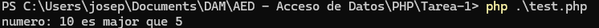

2. **Edad permitida**  
   Pide la edad de una persona y muestra:  
   - `"Eres menor de edad"` si es < 18.  
   - `"Eres mayor de edad"` si es ≥ 18.  

```php

<?php
$edad = 10;
if ($edad >= 18 ){
    echo "Eres mayor de edad";
}
else{
    echo "Eres menor de edad";
}
?>
```

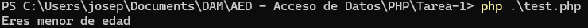

3. **Positivo, negativo o cero**  
   Comprueba si un número almacenado en una variable es positivo, negativo o cero.  

```php
<?php
$numero = 5;
if ($numero = 0 ){
    echo"este numero es igual a cero";
}
elseif ($numero < 0 ){
    echo"este numero es negativo";
} else{
    echo "este numero es positivo";
}

?>
```

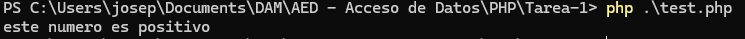

4. **Nota final**  
   Pide la nota de un alumno y muestra:  
   - `"Suspenso"` (< 5), `"Aprobado"` (5–6), `"Notable"` (7–8), `"Sobresaliente"` (9–10).  

```php
<?php
$nota = 5;
if ($nota <  5 ){
    echo"Suspenso";
}
elseif ($nota >  8 ){
    echo"Sobresaliente";
}
elseif ($nota >  6 ){
    echo"Notable";
}
elseif ($nota >  4 ){
    echo"Aprobado";
}

?>
```

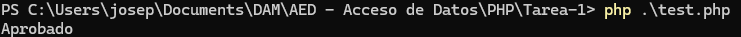

5. **Contar del 1 al 100**  
   Muestra los números del 1 al 100 en pantalla.  

```php
<?php
$numeros = 1;

while ($numeros != 101) {
    echo "Numero: $numeros ";
    $numeros++;
}
?>
```

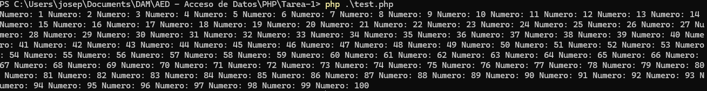

6. **Suma acumulada**  
   Calcula la suma de los números del 1 al 50 usando un bucle.  

```php
<?php
$number = 0;
for ($i = 1; $i <= 50; $i++) {
    $number = $number +$i;
}
 echo $number;
?>

```

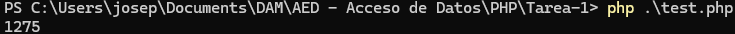

7. **Tabla de multiplicar**  
   Pide un número y genera su tabla de multiplicar del 1 al 10.  

```php
<?php
$number = 1;
for ($i = 1; $i <= 10; $i++) {
    $result =$number *$i;
    echo "$number x $i = $result \n";
}
?>
```

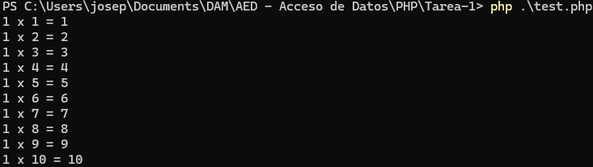

8. **Números pares**  
   Muestra todos los números pares entre 1 y 50.  

```php
<?php
for ($i = 2; $i < 50; $i++) {
    echo "$i\n";
}
?>
```

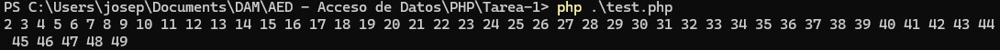

9. **Cuenta atrás**  
   Haz un bucle que cuente de 10 a 1 y luego muestre `"¡Fin!"`.  

```php
<?php
$numero = 10;
while ($numero != 0) {
    echo "$numero \n";
    $numero--;
}
echo '¡Fin!';
?>
```

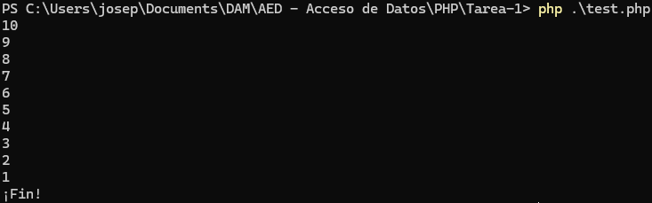

10. **Factorial**  
    Calcula el factorial de un número introducido (ejemplo: `5! = 120`).  

```php
<?php

function factorial($number) {
    $result = 1;
    for ($i = 1; $i <=$number ; $i++) {
    $result *= $i;
};
    return $result;
    }
echo factorial(5);
?>
```

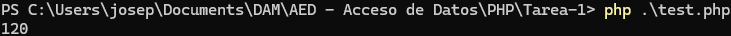

11. **Números primos**  
    Escribe un algoritmo que muestre los números primos entre 1 y 50.  

```php
<?php
for ($i = 2; $i < 50; $i++) {
    $isPrime = true;
    
    for ($e = 2; $e < $i; $e++) {
        if ($i % $e == 0) {
            $isPrime = false;
        }
    }
    
    if ($isPrime) {
        echo $i . " ";
    }
}
?>
```

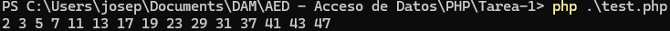

12. **Fibonacci**  
    Genera los primeros 20 términos de la secuencia de Fibonacci.  

```php
<?php
$prev = 0;
$current = 1;

for ($i = 1; $i <= 20; $i++) {
    echo "$prev\n";
    
    if ($i < 20) { 
        $next = $prev + $current;
        $prev = $current;
        $current = $next;
    }
}
?>
```
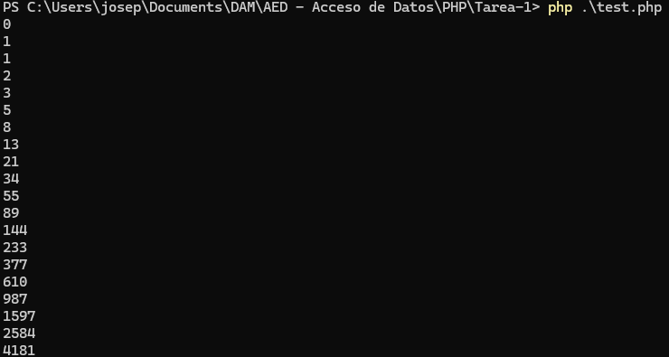

13. **Múltiplos de un número**  
    Pide un número `n` y muestra sus múltiplos hasta 100.  

```php
<?php
$number = 10 ;
    for ($i = 0; $i <= 100; $i++) {
        if ($i % $number == 0){
            echo "$i\n";
        }
    }
?>
```

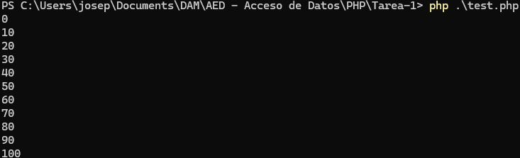

14. **Suma de pares e impares**  
    Calcula la suma de los números pares e impares entre 1 y 100 por separado.  

```php
<?php
$number = 0;
$number2 = 0;
for ($i = 2; $i <= 99; $i++) {
    if ($i % 2 == 0){
        $number +=$i;
    } else{
        $number2 +=$i;
    }
}
echo "$number\n";
echo $number2;
?>
```
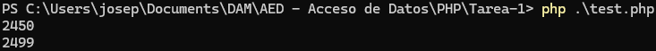

15. **Adivinar número**  
    Genera un número aleatorio entre 1 y 20.  
    Pide al usuario que lo adivine y usa un bucle con condicionales para dar pistas: `"Mayor"` o `"Menor"`.  

```php
<?php
$rannumber = rand(1,20);
$result = false;

while ($result != true){
    $guess = (int)readline("adivina el numero ");
    
    if ($rannumber == $guess){
        $result = true;
        echo "Correcto El numero era $rannumber\n";
    }elseif ($guess < $rannumber) {
        echo "Mayor\n";
    } else {
        echo "Menor\n";
    }
};
?>
```

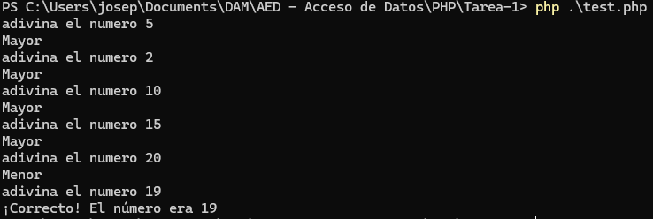

16. **Número perfecto**  
    Comprueba si un número es perfecto (la suma de sus divisores propios es igual al número).  

```php
<?php
$numero=6;
$result=0;
for ($i = 1; $i < $numero; $i++) {
    if ($numero % $i == 0){
        $result+=$i;
    }
}
if($numero == $result){
    echo "el numero es perfecto";
}

?>
```

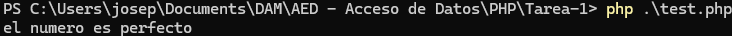

17. **Invertir número**  
    Escribe un algoritmo que invierta los dígitos de un número (ejemplo: `123 → 321`).  

```php
<?php
$number =123;
$inumber= (int)strrev((string)$number);
echo $inumber;

?>
```
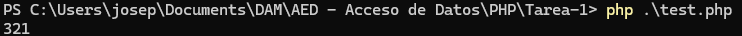

18. **Palíndromo**  
    Comprueba si una palabra almacenada en una variable es palíndroma.  

```php
<?php
$palabra = "reconocer";
$palindromo = strrev("reconocer");
if ($palabra == $palindromo){
    echo "es un palindromo ";
} else {
    echo "no es un palindromo ";
}
?>
```
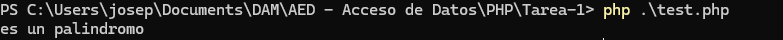

19. **Máximo común divisor (MCD)**  
    Escribe un algoritmo que calcule el MCD de dos números.  

```php
<?php
function mcd($a, $b) {
    
    while ($b != 0) {
        $temp = $b;
        $b = $a % $b;
        $a = $temp;
    }
    return $a;
}

$numero1 = 48;
$numero2 = 18;
$resultado = mcd($numero1, $numero2);

echo "$resultado";

?>
```
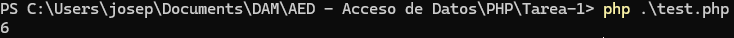

20. **Triángulo de asteriscos**  
    Muestra en pantalla un triángulo de altura `n` usando `*`.  
    Ejemplo con `n = 5`:  
    ```
    *
    **
    ***
    ****
    *****
    ```
    
```php
<?php
$n = 5;
for ($i = 1; $i <= $n; $i++) {
    echo str_repeat("*", $i)."\n";
}
?>
```
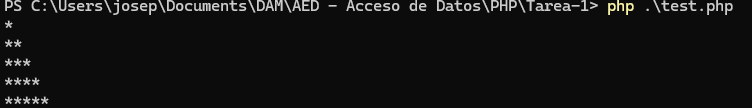

---