#Learn & Practice(Programación de Servicios y Procesos: "Procesos")

## Instrucciones de la práctica  

En esta práctica se trabajará en **dos fases complementarias**:

1. **Parte teórica:** Responde a los conceptos solicitados mediante la **búsqueda de información confiable**, citando siempre las **fuentes consultadas** al final de cada respuesta.  
2. **Parte práctica:** Ejecuta en Linux los **comandos indicados** y muestra la **salida obtenida** junto con una breve explicación de su significado.  

El objetivo es afianzar la comprensión de los **procesos en sistemas operativos**, tanto desde el punto de vista conceptual como práctico.  

## Bloque 1: Conceptos básicos (teoría)

1. Define qué es un **proceso** y en qué se diferencia de un **programa**.

Un proceso es una ejecucion de un programa en curso. La diferencia entre un  proceso y un programa es que el programa es instruciones en un lenguage de programacion

2. Explica qué es el **kernel** y su papel en la gestión de procesos.  

El kernel es el nucleo de un sistema operativo y es responsable de la gestion de recursos del ordenador y su papel en gestion de procesos es asignar los recursos necesarioas para crear un proceso

3. ¿Qué son **PID** y **PPID**? Explica con un ejemplo.  

pid es en numero que el sistema operativo asigna  a el proceso y Es el PID del proceso padre que creo al proceso actual. Cuando abres Google Chrome, el sistema operativo le asigna un PID único. Este proceso se convierte en el proceso padre.
Si abres más pestañas, cada una será un proceso hijo que hereda el PPID del proceso principal de Chrome.

4. Describe qué es un **cambio de contexto** y por qué es costoso.  

 un cambio de contexto es cuando un SO interrumpe la ejecuion de un proceso o hilo y es costoso proque requiere que el sistema guarde el estado actual

5. Explica qué es un **PCB (Process Control Block)** y qué información almacena. 

Un PCB es una estructura de datos que utiliza el sistema operativoi para almacenar toda la informacion de un proceso

6. Diferencia entre **proceso padre** y **proceso hijo**.  

La diferencia entre un proceso padre y un proceso hijo es que  el proceso padre es el proceso original y el proceso hijo es creado por el proceso padre

7. Explica qué ocurre cuando un proceso queda **huérfano** en Linux.  

el proceso que huerfano cuando el proceso padre acaba antes que el

8. ¿Qué es un proceso **zombie**? Da un ejemplo de cómo puede ocurrir.  

Un proceso que a ternimado so ejecucion pero todavia aparece en la tabla de procesos

9. Diferencia entre **concurrencia** y **paralelismo**.  

que con conrrencia son miltiple taresas al mismo tiempo pero no simultaniamente y paralelismo es que se ejecutan al mismo tiempo

10. Explica qué es un **hilo (thread)** y en qué se diferencia de un proceso.  

Un hilo es una de las posibles lineas de ejecución que sigue ese conjunto de instrucciones dentro de un proceso.
---

## Bloque 2: Práctica con comandos en Linux

11. Usa echo $$ para mostrar el PID del proceso actual.

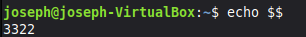

12. Usa echo $PPID para mostrar el PID del proceso padre.

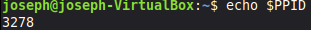

13. Ejecuta pidof systemd y explica el resultado.

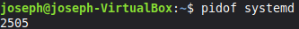

14. Abre un programa gráfico (ejemplo: gedit) y usa pidof para obtener sus PID.

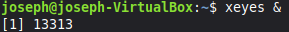
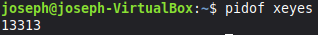

15. Ejecuta ps -e y explica qué significan sus columnas.

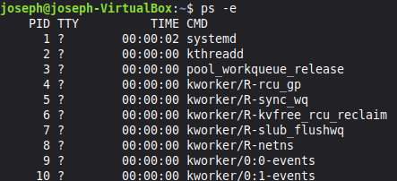

Las columnas significan pid el id del proceso , TTY donde se ejecuto el proceso, TIME tiempo  total de uso del cpu por el proceso y CMD el comando que incio el proceso

16. Ejecuta ps -f y observa la relación entre procesos padre e hijo.

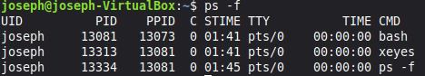

17. Usa ps -axf o pstree para mostrar el árbol de procesos y dibújalo.

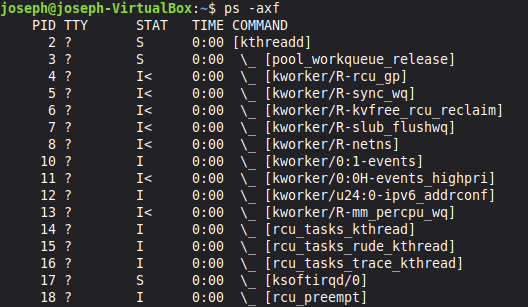

18. Ejecuta top o htop y localiza el proceso con mayor uso de CPU.

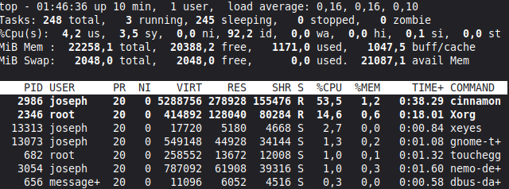

19. Ejecuta sleep 100 en segundo plano y busca su PID con ps.

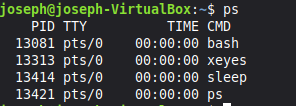

20. Finaliza un proceso con kill <PID> y comprueba con ps que ya no está.

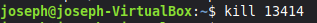

## Bloque 3: Procesos y jerarquía

21. Identifica el **PID del proceso init/systemd** y explica su función.

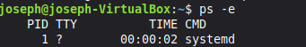
systemd es el sistema de inicio y un administrador de servicios

22. Explica qué ocurre con el **PPID** de un proceso hijo si su padre termina antes.

Cuando su padre termina anter el proceso hijo se convirte en un huerfano y es adoptado por el proceso systemd

23. Ejecuta un programa que genere varios procesos hijos y observa sus PIDs con `ps`.

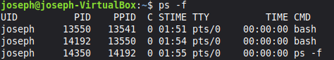

24. Haz que un proceso quede en **estado suspendido** con `Ctrl+Z` y réanúdalo con `fg`.

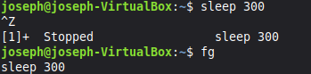

25. Lanza un proceso en **segundo plano** con `&` y obsérvalo con `jobs`.

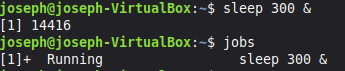

26. Explica la diferencia entre los estados de un proceso: **Running, Sleeping, Zombie, Stopped**.

la diferencia es que running es que el proceso esta corriendo , sleeping esta esperando ,stopped significa que esta detenido, zombie que el proceso esta detenido esperando que el padre lo lea.

27. Usa `ps -eo pid,ppid,stat,cmd` para mostrar los estados de varios procesos.

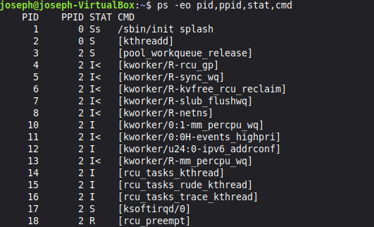

28. Ejecuta `watch -n 1 ps -e` y observa cómo cambian los procesos en tiempo real.

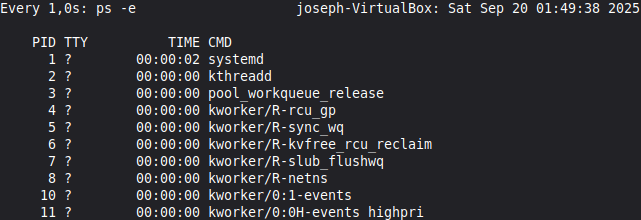

29. Explica la diferencia entre ejecutar un proceso con `&` y con `nohup`.

& ejecuta en segundo plano mientras que noup evita que el proceso se cierre con SIGHUP 

30. Usa `ulimit -a` para ver los límites de recursos de procesos en tu sistema.

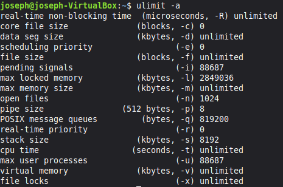
